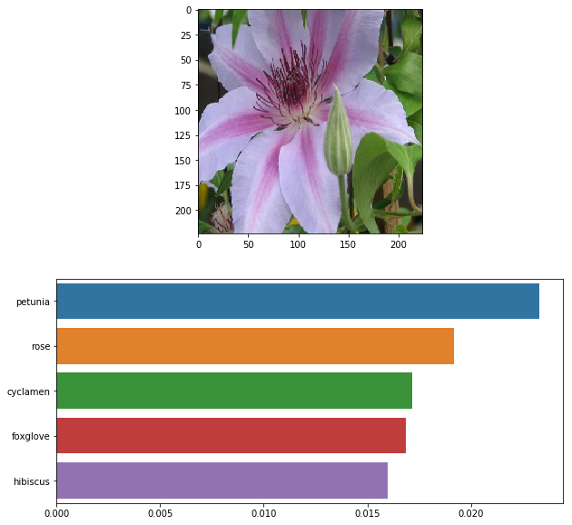

# Deep Learning Image Classifier
(The project is currently being extended to support traffic sign recognition)

## Motivation
I am strong beliver in positive impact of AI, Deep Learning and Computer Vision on our lifes. 
From self-driving cars, to health care and early diagnosis.

I did basic of this project during one of my Udacity courses, where my goal was to build this image classifier and train it on a dataset of flowers.
Later, I decided to extend it and train it to recognize traffic signs as this is one of the functions that self-driving cars needs to deal with.

I build it in a generic way, so you can use the model and retrain it on any dataset of your choice under MIT licence.
You can work with Jupyter Notebook or use console applications I prepared and deploy it on your server.

## Project description: overview

The project uses Deep Learning based Image Classifier to categorize images. 

To train the image classifier against your dataset, the transfer learning is used. 
Pretrained VGG16 network is loaded and its classifier is replaced by our classifier taking into account number of output labels your dataset has. 
This classifier is then retrained to classify your dataset.

## Image Classifier Performance
The image classifier was tested against dataset of traffic signs and dataset of flowers

For Traffic signs dataset had accuracy of x%(still in training) after 3 epochs of training
For Flowers dataset had accuracy of 81% after 3 epochs of training  

## Usage

1. Prepare your dataset

1.1 Download your dataset
A. [Traffic Signs Dataset](http://benchmark.ini.rub.de/?section=gtsrb&subsection=dataset) of 43 traffic sign categories
B. [Flowers Dataset](http://www.robots.ox.ac.uk/~vgg/data/flowers/102/index.html) of 102 flower categories
C. Any dataset of your choice

1.2 Prepare your dataset into the right folder structure
For model to work, you need to ensure that data are in one folder prepared in the following subfolders:
- `train` for training data
- `valid` for validation data used as intermediate feedback during training
- `test` for test data used to evaluate trained model performance

Flowers dataset is prepared in such a way. Traffic signs dataset need small modifications for which you can use prepared code in jupyter notebook.

2. Train the image classifier
- either by executing training cell in Jupyter notebook or with the console application`

Training with the console application `train.py:
- Basic usage: run `python train.py --data_dir my_directory --output_cat 43`

Mandatory parameters:
- Dataset directory used for training `--data_dir`
- Number of categories classifier needs to recognize `--output_cat`

Other parameters:
- Image dataset means `--means`. Default value: `--means [0.485, 0.456, 0.406]` (taken from VGG dataset) 
- Image dataset stds `--stds`. Default value: `--stds [0.229, 0.224, 0.225]` (taken from VGG dataset)  
- Choose architecture: `--arch`. Default value: `--arch vgg16`. Possible values: `--arch vgg16` or `--arch vgg13`
- Directory to save trained model checkpoint: `--save_dir`. Default value: `--save_dir assets/model/checkpoint_script.pth`
- Learning rate `--learning_rate`. Default value: `--learning_rate 0.03` 
- Learning epochs `--epochs`. Default value: `--epochs 7`
- Computing device: `--device`. Default value: `--device cpu`. Possible values: `--device cpu` or `--device gpu`

3. Use the trained image classifier to recognize your images
- either by executing predict cell in Jupyter notebook or with the console application 

Predicting with the console application `predict.py`:
- Basic usage: run `python predict.py --input "/path/to/image --checkpoint "checkpoint.pth"`

Mandatory parameters:
- Path to image to be predicted `--input`
- Path to checkpoint with trained network to be used `--checkpoint`

Other parameters:
- Return top K most likely classes: `--top_k`. Example: `--top_k 3`
- Use a mapping of categories to real names: `--category_names`. Example: `--category_names cat_to_name.json`
- Image dataset means `--means`. Default value: `--means [0.485, 0.456, 0.406]` (taken from VGG dataset) 
- Image dataset stds `--stds`. Default value: `--stds [0.229, 0.224, 0.225]` (taken from VGG dataset) 
- Computing device: `--device`. Default value: `--device cpu`. Possible values: `--device cpu` or `--device gpu`

## Libraries used
Python 3
- pandas
- numpy
- torch
- torchvision
- matplotlib
- seaborn
- PIL

## Files in the repository
- `Image Classifier Project.ipynb.py`: Jupyter Notebook File containing the whole code
- `train.py`: contains functionality to retrain model for a dataset of your choice
- `predict.py`: contains functionality to classify an image
- `cat_to_name.json`: contains the mapping between image categories and their real name

## Project description: detail steps
In the project:
- First, image dataset is loaded and preprocessed
- Second, image classifier is trained on the dataset
- Third, trained classifier is used to classify provided image

In the step loading and reprocessing the image dataset:
- Data are loaded through `torchvision`
- Next, data are split between training, validation, and testing. For training I've augmented data by applying transformations such as random scaling, cropping and flipping to ensure that network is generalized and provides better performance.
- Lastly, means and standard deviations of the images are normalized to fit what the pre-trained network expects.

In the second step, to train the image classifier:
- Pre-trained network (VGG16) from `torchvision` is loaded
- Next, a new untrained `feed-forward network` as the classifier, using `ReLU activations`, `dropout` is created.
- Next, classifier layer is trained using `backpropagation`. Project could be extended to use tracked Loss and accuracy on the validation set to determine the best hyperparameters. 
- The training required usage of `GPU computing` for which is torch perfect fit.

In the last step, to use the trained classifier to predict image content:
- input images are processed to fit the trained model, so they are resized and normalized first.
- Lastly, you can find there a function to predict the top 5 most probable classes with their probabilities. Results are visualized to the user in the form of a barplot graph.
